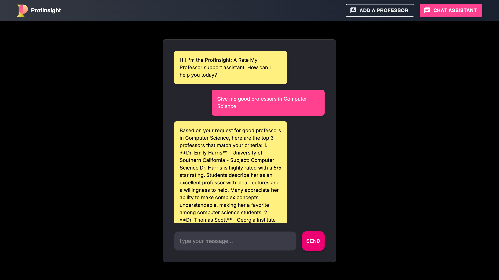

This is a [Next.js](https://nextjs.org/) project bootstrapped with [`create-next-app`](https://github.com/vercel/next.js/tree/canary/packages/create-next-app).



## Steps to run the application after cloning-

1. Go to OpenAI platform and generate OPENAI API key.
2. Similarly generate Pinecone API Key
3. There are two parts to the application- python and Javascript. To run Javascript/nextJS, make sure node is installed and to run the python part, install pip
4. Run the command- pip install -r requirements.txt
5. Run the command- npm install
6. Create two files .env and .env.local, and add both the API Keys to both of them. .env is for python and .env.local is for nextJS
7. Then go to the load.ipynb, and run all cells as it is a jupyter notebook and running it would generate index and namespace in pinecone.
8. Lastly run "npm run dev" to launch the application.

### UI is still in progress.

## Getting Started

First, run the development server:

```bash
npm run dev
# or
yarn dev
# or
pnpm dev
# or
bun dev
```

Open [http://localhost:3000](http://localhost:3000) with your browser to see the result.

You can start editing the page by modifying `app/page.js`. The page auto-updates as you edit the file.

This project uses [`next/font`](https://nextjs.org/docs/basic-features/font-optimization) to automatically optimize and load Inter, a custom Google Font.

## Learn More

To learn more about Next.js, take a look at the following resources:

- [Next.js Documentation](https://nextjs.org/docs) - learn about Next.js features and API.
- [Learn Next.js](https://nextjs.org/learn) - an interactive Next.js tutorial.

You can check out [the Next.js GitHub repository](https://github.com/vercel/next.js/) - your feedback and contributions are welcome!

## Deploy on Vercel

The easiest way to deploy your Next.js app is to use the [Vercel Platform](https://vercel.com/new?utm_medium=default-template&filter=next.js&utm_source=create-next-app&utm_campaign=create-next-app-readme) from the creators of Next.js.

Check out our [Next.js deployment documentation](https://nextjs.org/docs/deployment) for more details.
